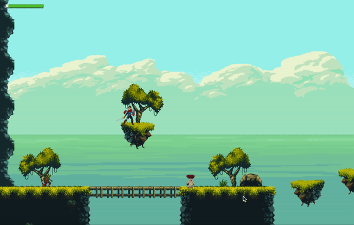

# RPG-CSUF-2020 RPG game project using Godot Engine.
- My contribution as a Leader/Programmer for a collab RPG Game project which is called Heroic Journey. 
    + Source code of main character and enemies:
- Some higlights:
    + Implemented A.I for enemies that they will able to roam freely, actively search for and chase main player.

Monster AI:

In-game Demo:

Emails:
● Daisy Ngo: dngo94@csu.fullerton.edu - Leader/Programmer/Notetaker
● Gordon Dan: gdan189@csu.fullerton.edu - Programmer/Notetaker
● Jacqueline Kubiak: jkubs@csu.fullerton.edu - Programmer/Notetaker
● Pola Eskandar: billy.schoolofficial@gmail.com - Stakeholder/Programmer

Assets credits Credits:

- Hero Knight: 
    a. Asset package: https://sventhole.itch.io/hero-knight b. Contact: https://sventhole.artstation.com/ c. Twitter: http://twitter.com/Sven_Thole/
-Magic Cliff: 
    a. Asset package: https://ansimuz.itch.io/magic-cliffs-environment b. Contact: http://ansimuz.com/ c. Twitter: https://twitter.com/ansimuz/
-Monsters-Creatures-Fantasy: 
    a. Asset package: https://luizmelo.itch.io/monsters-creatures-fantasy b. Contact: https://luizmelo.artstation.com/ c. Twitter: https://twitter.com/LuizGdeMelo
-Health Bar Asset Back 2: 
    a. Asset package:https://adwitr.itch.io/pixel-health-bar-asset-pack-2 b. Contact: https://adwitrahman.com/ c. Twitter: https://twitter.com/adwitr d. Linkedin: https://www.linkedin.com/in/adwit-rahman-a29016166/ e. Facebook: https://www.facebook.com/adwitr
-2d Pixel Items: 
    a. Asset Package: https://startledpixels.itch.io/2d-pixel-item-asset-pack b. Twitter: https://twitter.com/startledpixels
-Medieval Fantasy Character Pack 2 
    a. Asset package: https://oco.itch.io/medieval-fantasy-character-pack-2 b. Contact: https://oco.itch.io
-Dark Forest 
    https://szadiart.itch.io a. Asset package: https://szadiart.itch.io/pixel-dark-forest b. Contact: https://szadiart.itch.io c. Email: szadiart@onet.eu
-STRINGSTAR FIELDS 
    a. Asset package: https://trixelized.itch.io/starstring-fields b. Contact: Trixie c. Twitter: @Trixelized
-Platformer Music Pack Lite 
    a. Asset package: https://void1gaming.itch.io/platformer-music-pack-lite b. Contact: VOiD1 Gaming c. Website: www.void1gaming.com/ d. Twitter: @void1games
-Free Game Music Pack 
    a. Asset package: https://invadableharmony.itch.io/free-game-music-pack b. Contact: Invadable Harmony c. Website: invadableharmony.com/ d. Twitter: @Invadablharmony
-Gems / Coins Free 
    a. Asset package: https://laredgames.itch.io/gems-coins-free b. Contact: La Red Games c. Website: laredgames.comli.com d. Twitter: @LaRedGames
-Fairy on Fire - Art Challenge by Tad Miller 
    a. Asset package: https://opengameart.org/content/fairy-on-fire-art-challenge b.Contact: https://opengameart.org/users/tad
-Page Turning SFX Sound Effect by Nicole Marie T 
    a. Asset package: https://opengameart.org/content/page-turning-sfx-sound-effect
-Dark Descent by Matthew Pablo 
    a. Asset Package: https://opengameart.org/content/dark-descent b. Contact: https://matthewpablo.com/contact/

-Dialogue Design by Pola Eskandar a. Contact: billy.schoolofficial@gmail.com
